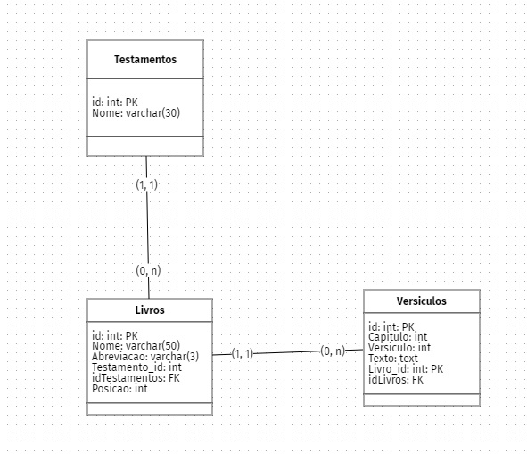
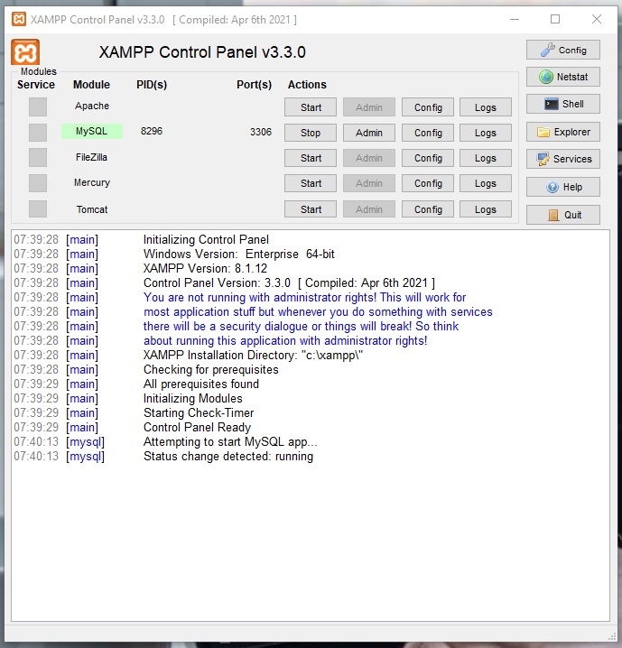
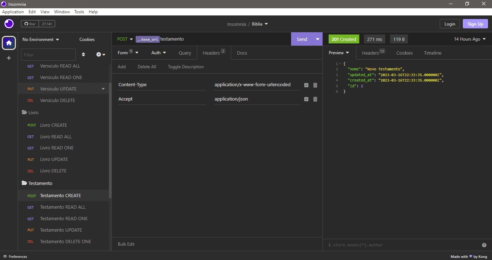

### Bíblia

#### Objetivo

Construir a API para ser consultada pelo frontend e exibido na aplicação.

#### Informações Técnicas

- API Rest em PHP

#### Desenvolvimento do Projeto

- CRUD + patch: post, get, put, delete e atualização parcial
- Ambiente de desenvolvimento:
  - XAMPP: apache, php, mysql:3306
  - compose: gerenciar dependências do php
  - SQLyog: manipulação de BD
  - VSCode: IDE + Extensões
  - brModelo: modelos do projeto
  - Laravel: 8000
- Modelo de bd
  

  

    

- criar frontend: `composer create-project laravel/laravel biblia`
- cd biblia
- subir o frontend: `php artisan serve`: localhost:8000
- subir o servidor db: `start` xampp / mysql : 3306
- XAMPP MySQL
  

  

  

- conectar sqlyog: biblia_connection
- criar db: biblia / utf8mb4 / utf8mb4_general_ci
- insomnia para testar as rotas e métodos HTTP
- estrutura do projeto: controller, model, api, migrations
- `http://127.0.0.1:8000/api/teste`
- `php artisan make:model Testamento --migration`
- app/Models/Testamento.php
- database/migrations/create_testamentos_table.php
- criar arquivo migrate: `php artisan make:model Livro --migration` 
- criar arquivo migrate: `php artisan make:model Versiculo --migration` 
- rodar as migrations e criar as tabelas: `php artisan migrate`: Livros, Testamentos, Versiculos
- criar o controller: `php artisan make:controller TestamentoController --api`
- criar o controller: `php artisan make:controller LivroController --api`
- criar o controller: `php artisan make:controller VersiculoController --api`
- configurar os métodos HTTP e o CRUD no insomnia
- Requisições Insomnia
  

  

    

- Programar o projeto nos arquivos
  - app/Http/Controllers/: Livro, Testamento, Versiculo
  - app/Http/Models/: Livro, Testamento, Versiculo
  - database/migrations/: create_testamentos, create_versiculos, create_livros
  - routes/app/api.php: rotas para o CRUD : Livro, Testamento, Versiculo

#### Detalhes 
