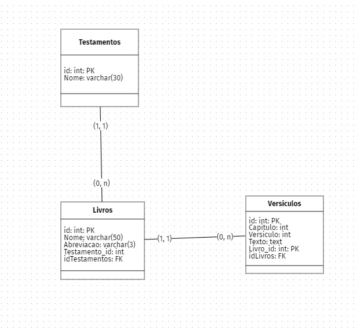

### Bíblia

#### Objetivo

Construir a API para ser consultada pelo frontend e exibido na aplicação.

#### Informações Técnicas

- API Rest em PHP

#### Desenvolvimento do Projeto

- CRUD + patch: post, get, put, delete e atualização parcial
- Ambiente de desenvolvimento:
  - XAMPP: apache, mysql, php
  - compose: gerenciar dependências do php
  - SQLyog: manipulação de BD
  - VSCode: IDE + Extensões
  - brModelo: modelos do projeto
- Modelo de bd
  

  

    

#### Detalhes 
